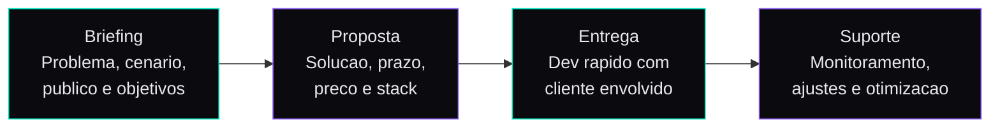

<div align="center">

<!-- HEADER WAVE -->


<!-- TYPING ANIMATION -->
<a href="https://git.io/typing-svg"></a>

<br/>

```javascript
const barbosa = {
    brand: "Barbosa.maker",
    name: "Luan Barbosa",
    location: "Foz do Iguacu, PR — Brasil",
    role: "Freelance Tech · Landing Pages · Automacoes · IA",
    background: "Ex-advogado → 6.000+ processos → Pivotou pra tech",
    clients_served: "3.315+",
    automations_in_production: "16+",
    ai_assistants_running: 3,
    available: true
};
```

<br/>

<!-- CONTACT BADGES -->
[](https://wa.me/5545999957851)
[](https://instagram.com/barbosa.maker)
[](mailto:barbosa.maker@gmail.com)
[](https://workana.com/freelancer/483fdac1b90ee58593f8a4308ed85a3a)
[](https://barbosamaker.com.br)

</div>

---

## Quem e Barbosa.maker

> **Freelancer brasileiro especializado em landing pages de alta conversao, automacoes inteligentes e sistemas com IA.**

Sou **advogado de formacao**, fundei duas legaltechs e protocolei **+6.000 processos** em todos os estados do Brasil com uma equipe de ~15 pessoas. Operando no volume, percebi que minha paixao real era a tecnologia por tras — as automacoes, os sistemas, a IA que fazia tudo funcionar.

Hoje uso essa experiencia de quem **entende negocios de verdade** pra construir solucoes digitais que convertem, automatizam e escalam. Ja atendi **3.315+ clientes**, tenho **16+ automacoes em producao** e **3 assistentes IA rodando 24/7**.

<br/>

### Formacao

| | |
|:--|:--|
| 🎓 | **Direito** — Centro Universitario Dinamica das Cataratas (UDC) |
| 🤖 | **IA & Automacao** — Promovaweb IA Makers |
| 🤖 | **IA & Automacao** — AI Coders Academy |
| 🤖 | **IA & Automacao** — Dinastia |
| 🤖 | **IA & Automacao** — Academia Lendaria |

<br/>

---

## Stack

<div align="center">

| Frontend | Backend & Data | IA & Automacao |
|:--------:|:--------------:|:--------------:|
|  |  |  |
|  |  |  |
|  |  |  |
|  |  |  |
|  |  |  |

</div>

<br/>

---

## Servicos

<table>
<tr>
<td width="33%" align="center">

### 🚀 LP Express
**R$ 500 — 800**

Landing page responsiva de alta conversao otimizada para captura de leads.

`React` `Tailwind` `Cloudflare`

**24 — 72h**

</td>
<td width="33%" align="center">

### 🔗 LP + Automacao
**R$ 1.000 — 1.500**

LP integrada com CRM, WhatsApp, email marketing e formularios automaticos.

`React` `n8n` `Supabase` `WhatsApp`

**3 — 5 dias**

</td>
<td width="33%" align="center">

### 💎 Web App / Chatbot
**R$ 1.500 — 2.500**

Sistemas completos com painel admin, chatbots IA e integracoes avancadas.

`React` `Supabase` `IA` `Node.js`

**5 — 7 dias**

</td>
</tr>
</table>

<br/>

---

## Projetos em Producao

<table>
<tr>
<td width="50%">

#### [Correcao Monetaria — Calculadora](https://barbosamaker.com.br/portfolio/calculadora-correcao-monetaria/)
Calculadora profissional com API do Banco Central, multiplos autores, Lei 14.905/2024, export PDF/DOCX.
`React` `API BCB` `TypeScript` `PDF`

</td>
<td width="50%">

#### [Calculadora INSS — GaranteDireito](https://barbosamaker.com.br/portfolio/calculadora-garantedireito/)
Calculadora de honorarios para beneficios do INSS com formulario inteligente e WhatsApp.
`React` `Tailwind` `Zod`

</td>
</tr>
<tr>
<td width="50%">

#### [Negativacao v2 — GaranteDireito](https://barbosamaker.com.br/portfolio/negativacao-v2/)
LP dark de alta conversao para captura de leads de negativacao indevida. +2.400 leads em 3 meses.
`React` `Tailwind` `Workers` `WhatsApp`

</td>
<td width="50%">

#### [Onibus — Resolvoo](https://barbosamaker.com.br/portfolio/onibus-resolvoo/)
Landing page mobile-first para direito do passageiro de onibus.
`React` `Tailwind` `n8n`

</td>
</tr>
<tr>
<td width="50%">

#### [Ticket Scale — Plataforma](https://barbosamaker.com.br/portfolio/ticket-scale/)
Plataforma completa de vendas de ingressos com dashboard e checkout Stripe.
`React` `Supabase` `Stripe` `Payments`

</td>
<td width="50%">

#### [CapiChat — SaaS](https://barbosamaker.com.br/portfolio/capichat/)
Landing de venda para produto SaaS de chatbot com IA. Multi-secao + checkout.
`React` `Supabase` `IA` `Stripe`

</td>
</tr>
<tr>
<td width="50%">

#### [Negativacao v1 — GaranteDireito](https://barbosamaker.com.br/portfolio/negativacao-garantedireito/)
Primeira versao ranqueada na 1a pagina do Google para termos de negativacao indevida.
`React` `Workers` `SEO`

</td>
<td width="50%">

#### [Resolvoo — Institucional](https://resolvoo.com.br/)
Site institucional do escritorio Resolvoo com foco em captacao organica e presenca digital.
`React` `Tailwind` `SEO`

</td>
</tr>
</table>

<br/>

---

## GitHub Stats

<div align="center">


<br/>


</div>

<br/>

---

## Como trabalho



<br/>

---

## Numeros

<div align="center">

| | Metrica | Valor |
|:--:|:--------|:------|
| 👥 | Clientes atendidos | **3.315+** |
| ⚙️ | Automacoes em producao | **16+** |
| 🤖 | Assistentes IA rodando 24/7 | **3** |
| 📋 | Processos protocolados (legaltech) | **6.000+** |
| 🇧🇷 | Estados de atuacao | **Todos (27)** |

</div>

<br/>

---

<div align="center">

### Vamos construir algo?

**Disponivel para projetos freelance — remoto, mundial.**<br/>
Respondo em ate 2 horas com proposta personalizada.

<br/>

[](https://wa.me/5545999957851)
[](https://barbosamaker.com.br)

<br/>

`Foz do Iguacu, PR — Brasil` · `barbosa.maker@gmail.com` · `@barbosa.maker`

<br/>


</div>
